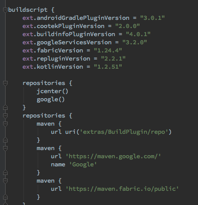

# Kotlin学习经验分享

## Henry Hu

---

## Scala,Groovy,Clojure,Kotlin解决了Java什么痛点?

* Scala:   想解决Java表达能力不足的问题
* Groovy:  想解决Java语法过于冗长的问题
* Clojure: 想解决Java没有函数式编程的问题
* Kotlin:  想解决Java

---

# 一、快速上手

最新版本 1.2.51

---

1、根目录build.gradle

```kotlin
buildscript {
    ext.kotlin_version = '1.2.51'
    dependencies {
        classpath "org.jetbrains.kotlin:kotlin-gradle-plugin:$kotlin_version"
    }
}
```

---

2、module层build.gradle

```kotlin
apply plugin: 'kotlin-android'
apply plugin: 'kotlin-android-extensions'
dependencies {
    implementation "org.jetbrains.kotlin:kotlin-stdlib-jdk7:$kotlin_version"
}
```

3、Xxx.kt

与Java Xxx.java主要区别在于Kotlin的文件名与类名可以不一样

---

```kotlin
class GuideKtActivity : AbsActivity() {
    private var mSubscriptions: CompositeSubscription? = null

    init {
        mSubscriptions = CompositeSubscription()
    }

    override fun initView() {
        val launchTime = LaunchTimeUtil.getTimeCalculate(LaunchTimeUtil.SPLASH_LAUNCH_NEXT)
        TLog.i(TAG, "SPLASH_LAUNCH_NEXT success, need [%s] ms", launchTime)
        if (launchTime != -1L) {
            bbase.usage().record(
                UserDataCollect.PREFIX_UI + UserDataCollect.SPLASH_LAUNCH_GUIDE,
                launchTime)
        }
        super.initView()
        setContentView(R.layout.layout_guide_activity)
        window.setFlags(WindowManager.LayoutParams.FLAG_FULLSCREEN,
                WindowManager.LayoutParams.FLAG_FULLSCREEN)
        close_btn.setOnClickListener { showPermissionRequest() }
    }

    override fun onDestroy() {
        super.onDestroy()
        mSubscriptions?.clear()
    }

    private fun showPermissionRequest() {}
    
    private fun launchNext(): Unit {}
    
    private fun buildIndicatorView(selected: Boolean) = View(baseContext)
    
    companion object {
        private val TAG = GuideKtActivity::class.java.
//        private const val TAG = "GuideKtActivity"
    }
}
```

---

# 二、Java、Kotlin混合使用

---

## 1、Kotlin调Java

基本丝滑过渡

```kotlin
val list = ArrayList<Int>()

VoipDb.getInstance(baseContext).`is`()
```

[jump code](#(28))

But:

T! means "T or T?" IDE检测不出

```kotlin
val javaClass : Class<GuideActivity> = GuideActivity::class.java
```

---

## 2、Java调Kotlin

稍微麻烦, 不够优雅

```java
CooTekUser user = new CooTekUser("1", "+27", "13212345678", "1234");
user.login();
```

[jump code](#(20))

But:

```java
VoipDb db = VoipDb.Companion.getInstances();

ViewExtKt.verticalRoundTranslate(...);

KClass<GuideKtActivity> kClass = kotlin.jvm.JvmClassMappingKt.getKotlinClass(GuideKtActivity.class);
```

---

# 三、我所了解的Kotlin

---

## 1、?.与!!与?:

只是编译时空"安全"。特别在与Java混合使用时, IDE检测不出空指针隐患

反思:

* 写Kotlin时, 什么时候需要Nullable(?)
* 写Java时，特别是sdk，多留意注解@Nullable, @NonNull

---

举个AhaCall的例子

```kotlin
//getKeyString Java源码中缺少注解@Nullable，IDE检测不出, 运行可能出现空指针
val number1 = PrefUtil.getKeyString(PrefKeys.TOUCHPAL_PHONENUMBER_ACCOUNT).trim()

val number2 = PrefUtil.getKeyString(PrefKeys.TOUCHPAL_PHONENUMBER_ACCOUNT)?.trim()
val number3 = PrefUtil.getKeyString(PrefKeys.TOUCHPAL_PHONENUMBER_ACCOUNT).trim() ?: ""
```

---

小心IDE自动转码, 常出现!!

!!少用, 空指针定时炸弹

举个AhaCall的例子

```kotlin
refreshFBUserInfo(mFBUser!!)
```

使用高阶函数let

```kotlin
mFBUser?.let { refreshFBUserInfo(it) }
```

---

## 2、尴尬的三目运算

Java:

```java
int max = (a >= b) ? a : b
```

Kotlin:

```kotlin
val max = if (a > b) a else b
```

---

## 3、when, 加强版的switch

* switch的基本功能
* 分支支持in、is的判断
* 可以没有自变量

---

```kotlin
when {
    "apple" in items -> println("found apple")
    str is String -> println("is String: $str")
    else -> ""
}
```

```kotlin
override fun onCreateViewHolder(parent: ViewGroup, viewType: Int): RecyclerView.ViewHolder =
        when (viewType) {
            R.layout.item_catagory_card -> CategoryCardViewHolder.create(parent, onLike)
            R.layout.item_network_state -> NetworkStateItemViewHolder.create(parent, retryCallback)
            else -> throw IllegalArgumentException("unknown view type $viewType")
        }
```

---

## 4、val与var

只读 | 可读写
-------|--------
val   | var (java 10支持var)
List   | MutableList
Set   | MutableSet
Map  | MutableMap

---

## 5、类、函数

* 增加data数据类, 告别set, get, equals, hashCode, toString
* 默认都是final、public, 不可继承, 继承需给父类加open
* 函数终于支持缺省值了, 并且函数可以与package同级

---

举个AhaCall的例子, data关键字

```kotlin
data class CooTekUser(
        val id: String, //只读, get
        var countryCode: String = "+86",
        var pureNumber: String = "13212345678",
        var code: String
){
    fun login() {}
}
```

---

缺省值

```java
public void share(final Context context, int style, String title, String subject, String content, Uri streamUri, String url, String imgUrl, String from){
    //...
}
```

```kotlin
fun share(context: Context, style: Int = 0, title: String = "", subject: String = "", content: String, streamUri: Uri, url: String = "", imgUrl: String = "", from: String){
    //...
}

fun testShare() {
    share(context = bbase.app(), content = "link", streamUri = "https://www.baidu.com".toUri(), from = "test")
}
```

---

继承

```kotlin
open class A

class B : A()

fun a() {}
```

---

## 6、扩展

ViewExt.kt

```kotlin
fun View.verticalRoundTranslate(delta: Float, duration: Long, repeatCount: Int){
    val translateAnim = TranslateAnimation(0f, 0f, 0f, -delta)
    translateAnim.duration = duration
    translateAnim.repeatMode = Animation.REVERSE
    translateAnim.repeatCount = repeatCount
    val animationSet = AnimationSet(false)
    animationSet.addAnimation(translateAnim)
    startAnimation(animationSet)
}
```

Kotlin:

```kotlin
    fab.verticalRoundTranslate(100f, 250, Animation.INFINITE)
```
But: Java中调Kotlin

```java
    ViewExtKt.verticalRoundTranslate(mDeliveryTabPop, 100f, 250, Animation.INFINITE);
```

---

Android KTX: androidx.core:core-ktx:1.0.0-alpha1

```kotlin
view.viewTreeObserver.addOnPreDrawListener(
    object : ViewTreeObserver.OnPreDrawListener {
        override fun onPreDraw(): Boolean {
            viewTreeObserver.removeOnPreDrawListener(this)
            actionToBeTriggered()
            return true
        }
    })

//KTX
view.doOnPreDraw {
     actionToBeTriggered()
}
```

---

## 7、Lambda, 去除大量模板化代码

Java:

```java
new Thread(new Runnable() {
    @Override
    public void run() {
        Log.d(TAG,"do something");
    }
}).start();

//java8
new Thread(() -> Log.d(TAG, "do something")).start();
```

Kotlin:

```kotlin
Thread(Runnable { Log.d(TAG, "do something") }).start()
Thread({ Log.d(TAG, "do something") }).start()
Thread() { Log.d(TAG, "do something") }.start()
Thread { Log.d(TAG, "do something") }.start()
```

---

带接受者的函数类型

```kotlin
//Int.(Int) -> Int, 带接受者的函数类型
val sum: Int.(Int) -> Int = { other -> this + other }
fun testSum() {
    println("1.sum(2)=${1.sum(2)}")
}
```

---

## 8、大量的高阶函数
let, invoke, with, apply, also, map, filter, reduce...

Java:

```java
if (callback != null) {
    callback.onStatus(NetworkState.LOADING);
}
```

Kotlin:

```kotlin
val onStatus: ((NetworkState) -> Unit)? = null
onStatus?.invoke(NetworkState.LOADING)
```

---

## 9、单例object, 委托by

实现饿汉式只需要

object MyClass

举个AhaCall的例子

```kotlin
object VoipDbHelper : SQLiteOpenHelper(bbase.app(), DATABASE_NAME, null, DATABASE_VERSION) {
    override fun onCreate(db: SQLiteDatabase?) {}

    override fun onUpgrade(db: SQLiteDatabase?, oldVersion: Int, newVersion: Int) {}
}

class VoipDb {
    companion object {
        //饿汉式
        fun getInstance() = VoipDb()

        //双重校验锁式, by委托,lazy延迟加载,线程安全
        val instances by lazy { VoipDb() }
    }
}
```

---

But: Java中调Kotlin

```java
VoipDbHelper.INSTANCE

VoipDb.Companion.getInstances()
```


---

## 10、Kotlin Android Extensions, Gradle插件

告别findViewById

并具有View cache

```kotlin
id.setOnClickListener{ //... }
```

---

Parcelable注解(实验性功能)

```kotlin
@Parcelize
data class CooTekUser(
        val id: String, //只读, get
        var countryCode: String = "+86",
        var pureNumber: String = "13212345678",
        var code: String
) : Parcelable
```

---

## 11、强大的DSL

DSL(Domain-Specific Language, 领域特定语言)指的是专注于特定问题领域的计算机语言(领域专用语言). 不同于通用的计算机语言(GPL), 领域特定语言只用在某些特定的领域.

Gradle

build.gradle



---

[经典例子](https://try.kotlinlang.org/#/Examples/Longer%20examples/HTML%20Builder/HTML%20Builder.kt)

利用嵌套闭包、扩展、函数接受者、操作符重载特性

```kotlin
fun main(args: Array<String>) {
    val result =
            html {
                head {
                    title { +"HTML encoding with Kotlin" }
                }
                body {
                    h1 { +"HTML encoding with Kotlin" }
                    p { +"this format can be used as an alternative markup to HTML" }
                }
            }
    println(result)
}
```

---

Anko, 使用代码生成UI布局

```kotlin
verticalLayout {
    val name = editText()
    button("Say Hello") {
        onClick { toast("Hello, ${name.text}!") }
    }
}
```

---

Kolley, 封装Volley

```kotlin
Http.get {
    url = "http://api.openweathermap.org/data/2.5/weather"

    params {
        "q" - "shanghai"
        "appid" - "d7a98cf22463b1c0c3df4adfe5abbc77"
    }

    onStart { log("on start") }

    onSuccess { bytes ->
        log("on success ${bytes.toString(Charset.defaultCharset())}")
    }

    onFail { error ->
        log("on fail ${error.toString()}")
    }

    onFinish { log( "on finish") }
}
```

---

# 四、干货

## 学习资源

*[KotlinThree](https://www.jianshu.com/c/ce44081f781f)*

*[kotliner.cn](https://www.kotliner.cn)*

*[张涛开源实验室Kotlin](https://kymjs.com/column/kotlin.html)*

## Google Sample

*[android-topeka](https://github.com/googlesamples/android-topeka)*

*[android-architecture-components](https://github.com/googlesamples/android-architecture-components)*

---

# 五、Demo

paging-rxjava2

kotlin


[paging](https://developer.android.google.cn/topic/libraries/architecture/paging)

[intro](https://codelabs.developers.google.com/codelabs/android-paging/index.html#9)

---

# Q&A

Thanks